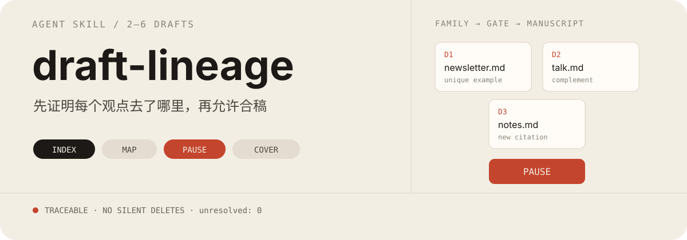
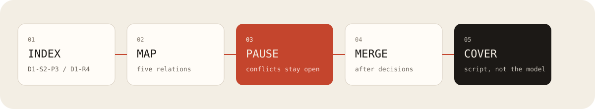
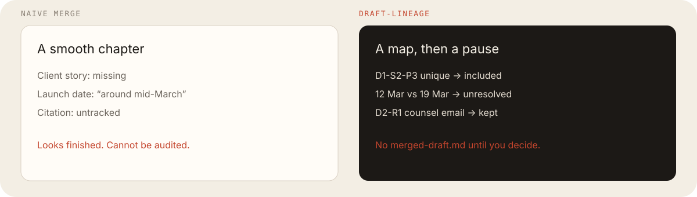

<p align="center">
  
</p>

`draft-lineage` 是一个 Agent Skill：手里已经有 2–6 份同一主题的旧稿，要合成一份，并且能查到每一段、每条引文从哪来。

多份同题旧稿合成一份可追溯成稿。先给段落和引文编号，冲突处停住等你决定，确认后再合稿。

Merge several drafts of the same subject into one traceable manuscript. Number paragraphs and citations first, pause on conflicts until you decide, then merge.

它不会把几份旧稿直接写成一篇读着顺的文章。流程是：先给每段和每条引文编号 → 标出重复、互补、后稿替换前稿、互相打架、以及只出现在一份稿里的内容 → 打架的地方停住等你拍板 → 再写合稿 → 最后用脚本核对每个编号都有去向。

<p align="center">
  
</p>

## 为什么不直接让模型合稿

直接合稿，读起来往往完整。缺的是证据：某一稿里独有的例子进了哪一节？两个互相打架的日期有没有被改成谁都没写过的「大约某天」？引文还对着原来的出处吗？

<p align="center">
  
</p>

| 直接让 AI 合稿，常见结果 | 这个 Skill 怎么做 |
|---|---|
| 某一稿里独有的段落不见了 | 只出现在一份稿里的内容必须进合稿，除非你亲自说删 |
| 冲突被润成「大约」 | 两边对不上就停住，先不写合稿 |
| 模型口头说「都保住了」 | 用脚本按编号核对，不靠模型自己宣布 |
| 比较同一文件的两个版本 | 不是这个工具的工作 |

## 它会写出哪些文件

写在稿件旁边的 `out/` 里（除非你另指定路径）：

| 文件 | 是什么 |
|---|---|
| `draft-inventory.json` | 每份稿、每段、每条引文的稳定编号 |
| `merge-map.csv` | 每个编号的关系和去向（留下、并进另一段、等你决定等） |
| `conflicts.md` | 必须由你拍板的项 |
| `synthesis-plan.md` | 合稿大纲，此时还没有正文 |
| `merged-draft.md` | 真正的合成稿；冲突还没处理完就不会写 |
| `coverage-report.md` | 脚本生成的核对报告；还有未决项就会失败 |

关系类型和去向状态只定义在 [`skills/draft-lineage/references/merge-contract.md`](skills/draft-lineage/references/merge-contract.md)。README 不重复那张表。

## 安装

Skill 目录是 `skills/draft-lineage/`。

Claude Code：

```bash
git clone https://github.com/Lucian1u/draft-lineage.git
cp -R draft-lineage/skills/draft-lineage ~/.claude/skills/draft-lineage
```

或把本仓库加为 plugin marketplace 后安装 `draft-lineage`。

Codex：

```bash
python3 ~/.codex/skills/.system/skill-installer/scripts/install-skill-from-github.py \
  --repo Lucian1u/draft-lineage \
  --path skills/draft-lineage
```

其他兼容 [Agent Skills](https://agentskills.io/) 的工具，把 `skills/draft-lineage` 复制到该工具的 skills 目录即可。

## 使用

把 Skill 和稿件放在同一轮任务里。先编号、先出冲突清单，不要一上来就写合稿。

```text
使用 draft-lineage，处理 fixtures/normal/ 里的三份稿。
先编号和出冲突清单，不要直接写合稿。
```

```text
使用 draft-lineage。两份稿对同一发布日给出了不同日期。
冲突处先停，等我逐项决定。
```

输入限于 2–6 个 UTF-8 的 Markdown 或纯文本。不要丢扫描 PDF、图片或音频。一份文件也不够，至少两份。

## 脚本

编号和核对只用 Python 标准库，不让模型自己宣布「没有遗漏」：

```bash
python3 skills/draft-lineage/scripts/index_drafts.py --self-test

python3 skills/draft-lineage/scripts/index_drafts.py index \
  skills/draft-lineage/fixtures/normal \
  -o /tmp/draft-inventory.json

python3 skills/draft-lineage/scripts/index_drafts.py coverage \
  --inventory /tmp/draft-inventory.json \
  --map /tmp/merge-map.csv \
  -o /tmp/coverage-report.md
```

出现空文件、两个文件同名、或稿里写了 `[3]` 却没有对应出处时，编号命令退出码非 0，不得进入合稿。

核对通过，只说明每个编号都有去向，不说明「这两段算重复」一定分对了。

## 示例稿

| 目录 | 用来验证 |
|---|---|
| [`fixtures/normal/`](skills/draft-lineage/fixtures/normal) | 跨稿重复、互补、独有例子和新来源都会进入合稿 |
| [`fixtures/conflict/`](skills/draft-lineage/fixtures/conflict) | 两个发布日对不上，必须停住 |
| [`fixtures/invalid/`](skills/draft-lineage/fixtures/invalid) | 空文件、两个文件同名、引用了不存在的 `[3]`，必须拒绝 |

完整跑通记录见 [`acceptance.md`](acceptance.md)。三组已经关掉：正常组合稿后未决项为 0；冲突组停在冲突清单；无效组在编号失败处被拒绝。

## 仓库结构

```text
draft-lineage/
├── assets/readme/          hero, flow, proof
├── skills/draft-lineage/
│   ├── SKILL.md
│   ├── agents/openai.yaml
│   ├── references/merge-contract.md
│   ├── scripts/index_drafts.py
│   └── fixtures/
├── docs/                   给后续对话用的交接，不是产品介绍
├── LICENSE
└── README.md
```

## 限制

- 不会从空白写文章，也不会上网补事实。
- 不会替你判断冲突里哪一边是对的。
- 核对报告不能证明「重复」没有分错。
- 不处理 Word 修订、git 冲突或 PDF 拼接。

## 贡献

见 [CONTRIBUTING.md](CONTRIBUTING.md)。不要提交「先写出合稿，再让用户去找错」的改法。那是本 Skill 存在的理由。

## License

[MIT](./LICENSE)
